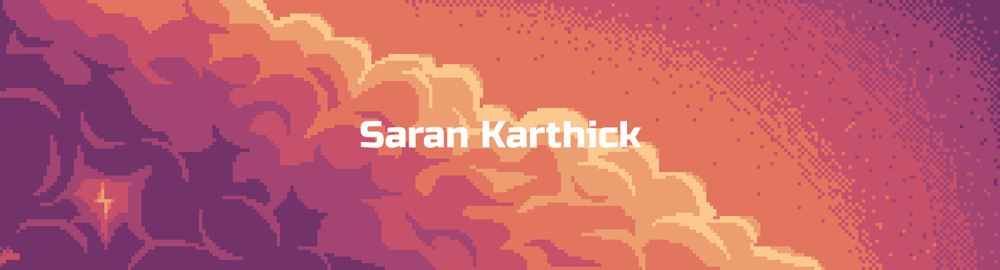

 
## I'm Saran karthick 

Welcome to my GitHub profile!

## 🚀 About Me
  I’m currently pursuing a BTech in Computer Science and Business Systems (CSBS), with a growing passion for web development and a strong curiosity in AI and Machine Learning. I'm actively exploring open-source collaborations and creating seamless digital experiences through code and creativity. I thrive at the intersection of innovation and execution—constantly learning, experimenting, and delivering projects that matter.

## 🛠️ Technologies & Tools
- **Languages & **: Python, C, Java, JavaScript, TypeScript.
- **Tools**: Figma, Blender, Git, Github, Visual Studio Code.<!-- Spacing above -->
  

<!-- Heatmap -->

<!-- Spacing below -->
  

